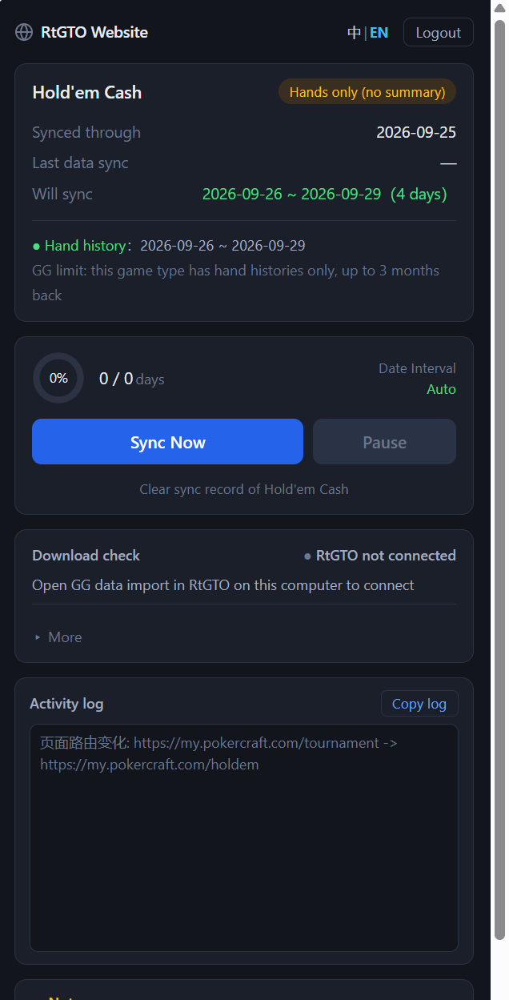

# GGPoker Record Download Helper

[中文](README.md) | **English**

Download your PokerCraft game summaries and hand histories in bulk: you no longer pick dates range by range or work out how to split them — the extension prepares each batch and you click download once to move on.

This is a paid, licensed product and requires an account.

## Highlights

- **The date range is chosen for you**: from the day after "Synced up to" through today — no range to set, no batches to work out
- **Batch spans are chosen for you**: the extension works out how many days each batch covers, narrowing it when the page list loads slowly or times out
- **One click per batch**: the extension selects the dates and highlights the download button; click it and the next batch begins. It will not continue until you click
- **Pause, resume, stop**: an interruption continues from where it stopped, and already-synced dates are not downloaded again
- **Dates with no data are skipped** automatically
- **A download ledger**: the outcome of every date range is recorded and can be exported as JSON or CSV
- **Missing pieces are repaired**: after a sync the results are checked, and gaps are downloaded automatically on the next sync
- **Optional verification with a local RealtimeGTO client**, which opens the files and confirms they actually arrived

## Installation

| Option | Best for | How |
| --- | --- | --- |
| Chrome Web Store | Almost everyone | Search the store for "GGPoker记录下载助手" and click "Add to Chrome" |
| Built into the RealtimeGTO client | Users who already run RealtimeGTO | Open the RealtimeGTO client → "GG Data Import" → "Install GG download extension"; the client unpacks the package and shows you where it is |
| GitHub Releases, manual install | Users who want to control the version themselves | Download the zip from this repository's Releases and follow the steps below |

Manual install steps:

1. Unpack the downloaded zip somewhere you will not delete by accident
2. Type `chrome://extensions/` in the address bar and press Enter
3. Turn on "Developer mode" in the top right
4. Click "Load unpacked" and select **the folder that directly contains `manifest.json`**

**The step people get wrong**: select the folder that holds `manifest.json` itself. If you pick its parent (your unzip tool added an extra level) or a child (the subfolder holding the interface files), Chrome will refuse to load it.

## Up and running in three steps

1. **Open a game page first**: on PokerCraft, open one of Tournaments (MTT), Rush & Cash, Hold'em Cash or Omaha (PLO) — the extension has to see the page to know which category you are syncing
2. **Sign in**: click the extension icon to open the side panel and log in
3. **Click "Sync Now"**: the extension picks the dates and highlights the download button; click it to download, and the next batch starts automatically until the sync is done

You click the download button once per batch — that is a limit of the page itself; the extension cannot click it for you.

## Documentation

- [Usage](docs/en/usage.md) — installation, signing in, syncing, verification, FAQ
- [Product Overview](docs/en/product.md) — what it solves, who it is for, where its limits are
- [Design Notes](docs/en/design.md) — why it is built this way

## Requirements

- Chrome 114 or newer
- Works on PokerCraft (`my.pokercraft.com`) only

## FAQ

**I installed it but clicking the icon does nothing.**
First check that the current page is on `my.pokercraft.com` — the extension only runs there, and other sites (ggpoker.com included) will not respond. Then check that your Chrome is version 114 or newer.

**It says "no category recognised".**
The extension needs to see which game page you are on. Open one of Tournaments (MTT), Rush & Cash, Hold'em Cash or Omaha (PLO) on PokerCraft, then open the side panel.

**Why do only the most recent 3 months have hand details?**
That is GGPoker's own limit: summaries cover at most 500 sessions within the last 12 months, and hand histories at most 20,000 hands within the last 3 months. Note also that **only Tournaments (MTT) have summaries**; Rush & Cash, Hold'em Cash and Omaha (PLO) carry hands only, so for those three nothing at all is available before that window.

**A download was interrupted. What now?**
Click "Sync Now" again. Already-synced dates are not downloaded twice; it continues from where it stopped.

**How do I get a licensed account?**
Register on the RtGTO website (a paid licence is required).

**Does it upload my data?**
Your account details and download records stay in your local browser. Apart from the login check, nothing is uploaded.

## License and disclaimer

This repository contains product documentation only, not the extension's source code. The documentation may be read and shared freely; redistributing, decompiling or commercially using the extension package is not allowed. See [LICENSE.md](LICENSE.md).

This product is not affiliated with GGPoker or PokerCraft, and is not sponsored or endorsed by them. When using it, you are responsible for complying with the terms of service of the source sites.
