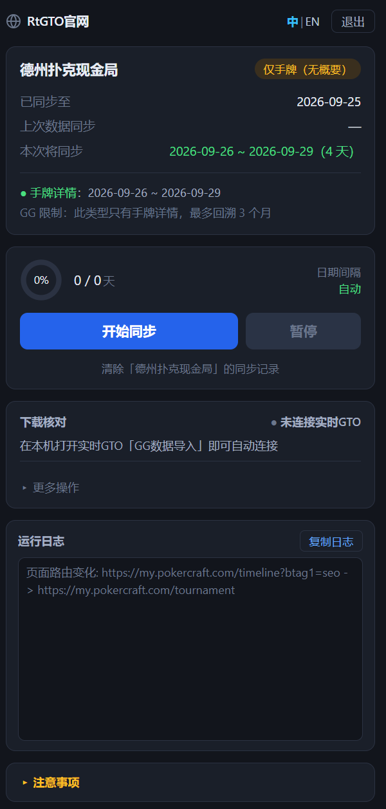

# GGPoker记录下载助手

**[English](README.en.md)** | 中文

把你在 PokerCraft 上的游戏概要和手牌历史批量下载到本地：不用自己一段段挑日期、不用管怎么分批——扩展把每一批准备好，你点一下下载就进入下一批。

这是一个付费授权产品，需要账号登录后使用。

## 功能亮点

- **日期区间自动决定**：从「已同步至」的次日算到今天，你不用设范围，也不用自己拆批
- **分批跨度自动决定**：每批覆盖多少天由扩展算，列表加载慢或超时就自动缩小
- **每批只需点一次下载**：扩展会把日期选好、把下载按钮高亮出来，你点完自动进入下一批，不点不会继续
- **可暂停、恢复、停止**，中断后从断点继续，已同步过的日期不会重复下载
- **没有数据的日期自动跳过**
- **下载记录**：每一段日期的处理结果都记下来，可导出 JSON / CSV 备查
- **漏下的可以补**：同步结束后自动核对，缺失的日期段下次同步时自动补下载
- **可选与本机实时GTO 联动核对**：由客户端打开文件，确认是不是真的下到了

## 安装

| 方式 | 适合谁 | 怎么做 |
| --- | --- | --- |
| Chrome 网上应用店 | 绝大多数用户 | 在商店搜索「GGPoker记录下载助手」，点「添加到 Chrome」 |
| 实时GTO 客户端内置 | 已经在用实时GTO 的用户 | 打开实时GTO 客户端 →「GG数据导入」→「安装GG数据下载扩展」，客户端会解压出安装包并告诉你位置 |
| GitHub Releases 手动安装 | 想自己控制版本的用户 | 到本仓库 Releases 下载 zip，解压后按下面的步骤加载 |

手动安装的步骤：

1. 解压下载的 zip 到一个不会随手删掉的目录
2. 地址栏输入 `chrome://extensions/` 回车
3. 打开右上角的「开发者模式」
4. 点「加载已解压的扩展程序」，**选中直接包含 `manifest.json` 的那个文件夹**

**手动安装最容易错的一步**：要选的是直接放着 `manifest.json` 的那一层。选成它的上一级（解压时多套了一层目录）或者下一级（放界面文件的那个子目录），Chrome 都会报错装不上。

## 三步上手

1. **先打开一个牌局页面**：在 PokerCraft 打开锦标赛 MTT、极速现金局、德州扑克现金局或奥马哈 PLO 中的一个页面——扩展要看到页面才知道你要同步哪一类
2. **登录**：点扩展图标打开侧边栏，输入账号密码登录
3. **点「开始同步」**：扩展会选好日期、把下载按钮高亮出来，你点一下下载；下完自动进入下一批，直到同步完

每批都要你点一次下载按钮——这是页面本身的限制，扩展不能替你点。

## 文档

- [使用说明](docs/zh/usage.md) —— 安装、登录、同步、下载核对、常见问题
- [产品介绍](docs/zh/product.md) —— 解决什么问题、适合谁用、能力边界
- [设计思路](docs/zh/design.md) —— 为什么这么设计

## 系统要求

- Chrome 114 或更高版本
- 仅在 PokerCraft（`my.pokercraft.com`）上生效

## 常见问题

**装了但点图标没反应？**
先确认当前页面在 `my.pokercraft.com` 上——扩展只在这个站点生效，其它网站（包括 ggpoker.com）点了不会有反应。再确认 Chrome 版本不低于 114。

**提示「没有识别出当前分类」？**
扩展需要先看到你在哪一类牌局页面上。请在 PokerCraft 打开锦标赛 MTT / 极速现金局 / 德州扑克现金局 / 奥马哈 PLO 中的一个页面，再打开侧边栏。

**为什么只有最近 3 个月有手牌详情？**
这是 GGPoker 自己的限制：概要最多可下载最近 12 个月内的 500 场，手牌最多可下载最近 3 个月内的 20,000 手。另外，**只有锦标赛 MTT 有概要**；极速现金局、德州扑克现金局、奥马哈 PLO 这三类只有手牌，所以更早的日期取不到任何记录。

**下载中断了怎么办？**
重新点「开始同步」。已经同步过的日期不会重复下载，会从断点接着跑。

**怎么拿到授权账号？**
在 RtGTO 官网注册（需付费授权）。

**会不会上传我的数据？**
账号信息和下载记录只存在本机浏览器里，除了登录校验不会上传任何数据。

## 许可与免责

本仓库只包含产品文档，不含扩展的源代码。文档可自由阅读与分享；扩展安装包禁止再分发、反编译或商用。详见 [LICENSE.md](LICENSE.md)。

本产品与 GGPoker、PokerCraft 及其运营方无任何关联，也未获得其赞助或背书。使用本产品时，你须自行遵守数据来源站点的服务条款。
